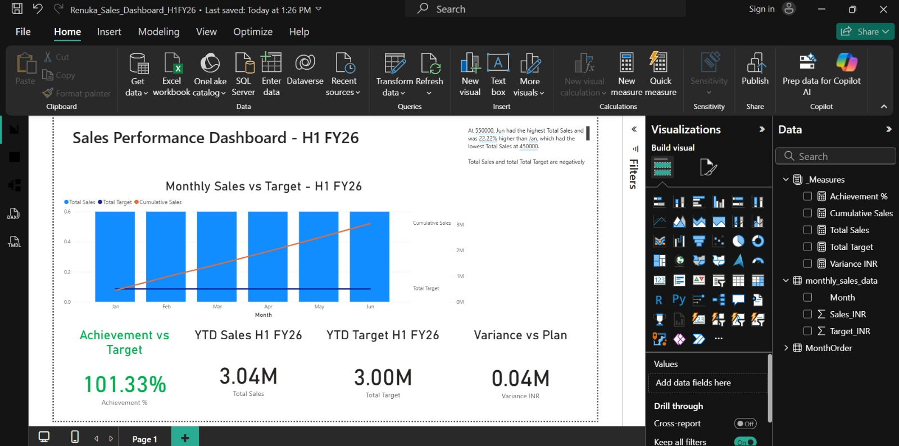

# Sales Performance Dashboard - H1 FY26 📊

## Overview
Interactive Power BI dashboard analyzing H1 FY26 sales vs target. 

**Business Impact**: Achieved **101.33% of target** by identifying June as key growth driver and flagging Feb risk month.

## Key Insights
- **Total Sales**: 3.04M vs 3.00M Target → **1.33% surplus**
- **Peak**: June 550K - 22% higher than Jan
- **Action Item**: Feb dip at 450K needs promotional strategy for FY27

## Tools & Techniques
- **Power BI**: Data modeling, Interactive visuals
- **DAX**: Achievement %, MoM Growth %, Conditional Formatting
-- **Storytelling**: Used Green/Orange bars for instant target tracking

## 🤖 Automation Layer - Python Pipeline
This dashboard is auto-updated using Python + GitHub Actions. No manual Excel updates needed.
**How it works**:
1. `ai_dashboard_pipeline.py` generates `monthly_sales_data.csv` + adds AI insights
2. GitHub Actions runs it every Monday 9 AM UTC via `.github/workflows/run_pipeline.yml`
3. Power BI connects to the auto-refreshed Excel → Dashboard always shows latest data

**Code Snippet**:
```python
# AI insight added automatically to data
ai_insight = "Sales grew 22% Jan-Jun. Focus marketing on Feb-Mar gap..."
df['AI_Executive_Insight'] = ai_insight
df.to_excel('automated_sales_data.xlsx')

## Dashboard Preview
## 📸 Dashboard Preview



## Author
Renuka | Aspiring Data Analyst
